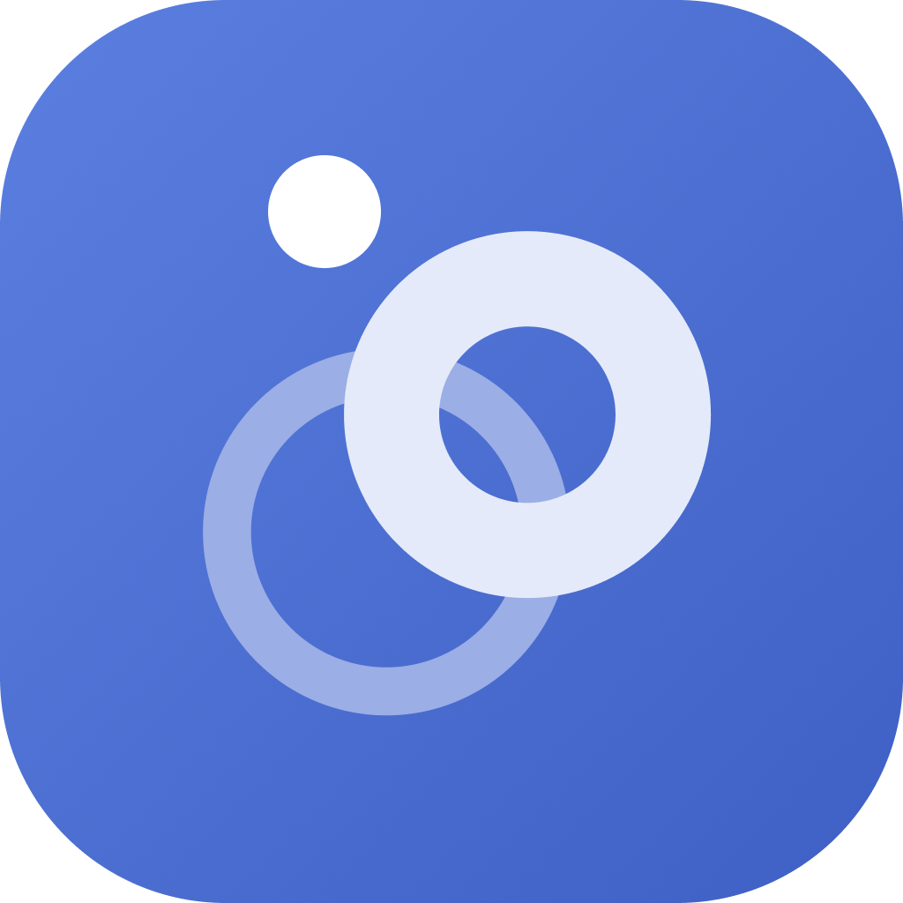

# ARP Vendor Lookup



A desktop tool that resolves an IP address to a MAC address and a vendor
name.

A Flutter desktop app reads the local ARP table to turn an IP into a
MAC, then calls a small Rails API to turn that MAC into a vendor name.

## Repository layout

| Path | What it is |
| --- | --- |
| [`app`](app/README.md) | Flutter desktop client — the UI, Bloc state management, recent-lookups history |
| [`api`](api/README.md) | Rails JSON API — resolves/caches MAC → vendor lookups against a public vendor-lookup service |
| [`packages/arp_resolver`](packages/arp_resolver/README.md) | Pure Dart — reads/parses the local ARP table (per-OS) and detects the local IP |
| [`packages/vendor_api_client`](packages/vendor_api_client/README.md) | Pure Dart — HTTP client for the Rails API |
| [`packages/vendor_lookup_repository`](packages/vendor_lookup_repository/README.md) | Pure Dart — caching/repository layer on top of `vendor_api_client` |
| [`packages/app_ui`](packages/app_ui/README.md) | Flutter — shared widgets and theme (design system) |

`app` depends on all four `packages/*` as local `path:` dependencies.
`api` is a standalone Rails app and doesn't participate in the Dart
dependency graph. See [`CLAUDE.md`](CLAUDE.md) for the full architecture,
engineering principles, and per-language conventions.

## Quickstart

Run the API first, then point the app at it:

```
cd api
bundle install
bin/rails db:prepare
bin/rails server            # http://localhost:3000
```

```
cd app
flutter pub get
flutter run -d macos        # or -d linux / -d windows
```

Each `packages/*` and `app` is a standalone Dart/Flutter project — `pub
get`/`flutter pub get` and test independently; there's no Melos or native
pubspec workspace tying them together.

## Testing

| Suite | Command |
| --- | --- |
| `packages/arp_resolver`, `packages/vendor_api_client`, `packages/vendor_lookup_repository` | `dart test` (run from each package directory) |
| `app`, `packages/app_ui` | `flutter test` (run from each directory) |
| `api` | `bin/rails test`, or `bin/ci` for the full check (setup, rubocop, bundler-audit, brakeman, tests) |

See [`CLAUDE.md`](CLAUDE.md)'s Testing section for what each suite is
expected to cover.
